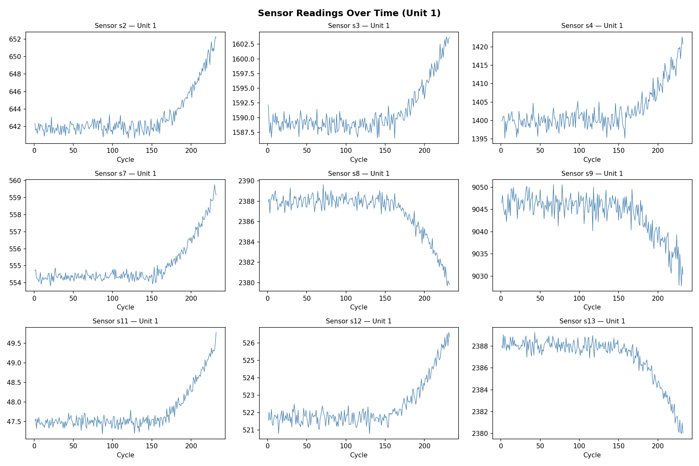
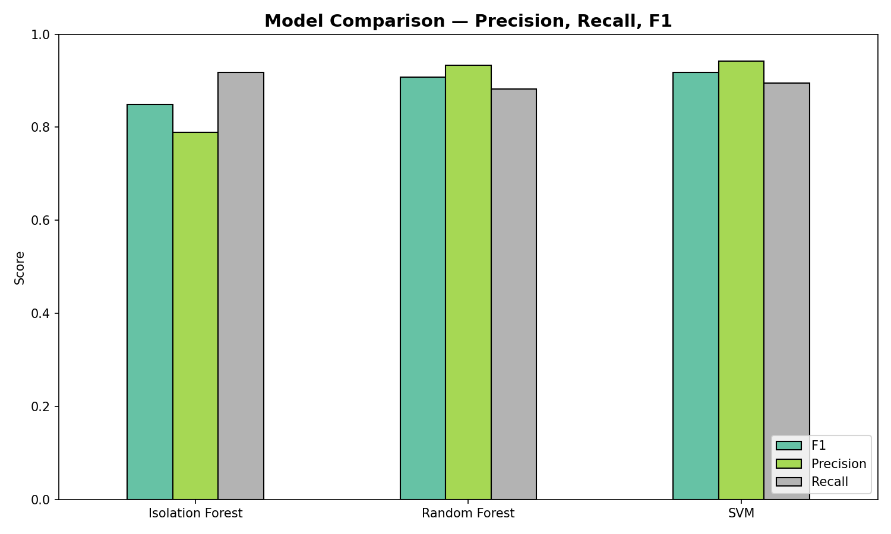
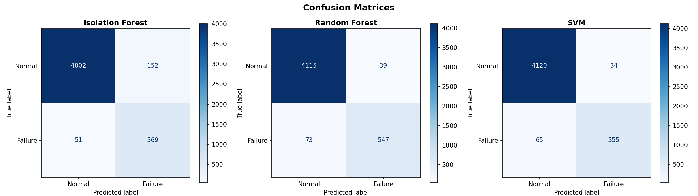
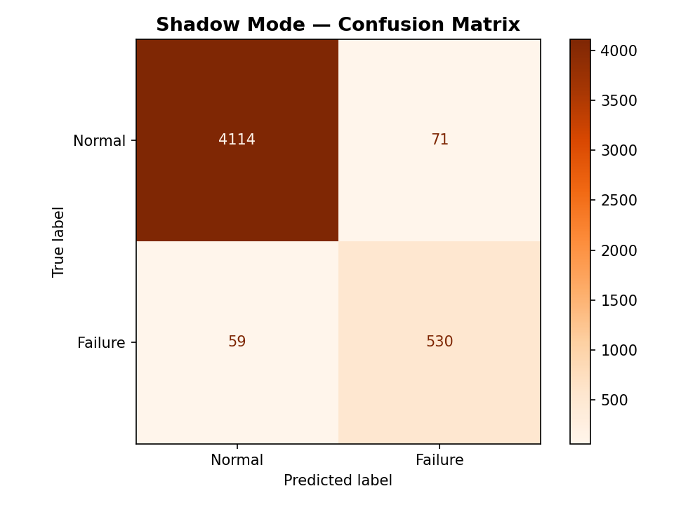

# 🛡️ SensorGuard — Predictive Anomaly Detection on Time-Series Data

[](https://www.python.org/)
[](https://scikit-learn.org/)
[](https://pandas.pydata.org/)
[](https://numpy.org/)
[](https://opensource.org/licenses/MIT)

An end-to-end Machine Learning pipeline for **predictive anomaly detection** on NASA CMAPSS industrial turbofan engine sensor data. The system engineers temporal features (lag + rolling statistics), trains and benchmarks three models, and simulates a real-world **shadow-mode deployment** for production ML validation.

---

## 🌟 Highlights

- **84 engineered features** from 21 raw sensor channels using rolling statistics and lag transforms
- **3 models benchmarked**: Isolation Forest (unsupervised), Random Forest, and SVM
- **Shadow-mode deployment simulation** mimicking real-world production ML validation
- **5-fold cross-validation** for generalizability assessment
- **Confusion matrices** and full classification reports for each model

---

## 📊 Model Performance

| Model | F1 Score | Precision | Recall |
| :--- | :---: | :---: | :---: |
| **SVM (RBF)** | **0.9181** | **0.9423** | **0.8952** |
| Random Forest | 0.9071 | 0.9334 | 0.8823 |
| Isolation Forest | 0.8486 | 0.7892 | 0.9177 |

### Best Model — Random Forest (Detailed)

| Class | Precision | Recall | F1-Score | Support |
| :--- | :---: | :---: | :---: | :---: |
| Normal | 0.98 | 0.99 | 0.99 | 4,154 |
| Failure | 0.93 | 0.88 | 0.91 | 620 |
| **Accuracy** | | | **0.98** | 4,774 |

**5-Fold Cross-Validation F1:** 0.8909 ± 0.0073

### Shadow-Mode Deployment Results

| Metric | Score |
| :--- | :---: |
| Shadow F1 Score | 0.8908 |
| Shadow Accuracy | 0.97 |

---

## ⚙️ Project Structure

```
SensorGuard/
├── train.py                 # Full ML pipeline (EDA → Train → Evaluate → Shadow Mode)
├── generate_data.py         # Synthetic CMAPSS data generator
├── generate_notebook.py     # Notebook builder & executor
├── sensor_guard.ipynb       # Jupyter Notebook with embedded outputs
├── requirements.txt         # Python dependencies
├── .gitignore
├── data/
│   └── train_FD001.txt      # NASA CMAPSS turbofan engine dataset
├── plots/
│   ├── sensor_trends.png        # Sensor readings over time (Unit 1)
│   ├── class_distribution.png   # Normal vs Failure class balance
│   ├── rul_distribution.png     # Remaining Useful Life histogram
│   ├── sensor_correlation.png   # 21-sensor correlation heatmap
│   ├── model_comparison.png     # Precision/Recall/F1 bar chart
│   ├── confusion_matrices.png   # Side-by-side confusion matrices
│   └── shadow_mode_confusion.png
└── saved_models/
    ├── random_forest_model.pkl  # Serialized best model
    └── scaler.pkl               # Fitted StandardScaler
```

---

## 🏗️ ML Pipeline Architecture

```
┌─────────────────────┐
│  NASA CMAPSS Data   │
│  (21 sensors × N)   │
└─────────┬───────────┘
          ▼
┌─────────────────────┐
│  RUL Label Creation  │
│  failure = RUL ≤ 30  │
└─────────┬───────────┘
          ▼
┌─────────────────────┐
│  Feature Engineering │
│  • Rolling mean (w=5)│
│  • Rolling std  (w=5)│
│  • Lag-1 features    │
│  21 → 84 features    │
└─────────┬───────────┘
          ▼
┌─────────────────────┐
│  StandardScaler      │
│  + Train/Test Split  │
└─────────┬───────────┘
          ▼
┌─────────────────────────────────────────┐
│  Model Training & Benchmarking          │
│  ┌──────────┐ ┌──────────┐ ┌─────────┐ │
│  │Isolation │ │ Random   │ │  SVM    │ │
│  │Forest    │ │ Forest   │ │ (RBF)   │ │
│  └──────────┘ └──────────┘ └─────────┘ │
└─────────────────────┬───────────────────┘
          ▼
┌─────────────────────┐
│  Evaluation          │
│  • F1, Precision,    │
│    Recall            │
│  • 5-Fold CV         │
│  • Confusion Matrix  │
└─────────┬───────────┘
          ▼
┌─────────────────────┐
│  Shadow-Mode Deploy  │
│  Hold out last 20%   │
│  of cycles as "live" │
│  production data     │
└─────────────────────┘
```

---

## 🔬 Feature Engineering Details

From 21 raw sensor channels, we engineer **84 total features** per sample:

| Feature Type | Count | Description |
| :--- | :---: | :--- |
| Raw sensors | 21 | Original CMAPSS sensor readings (s1–s21) |
| Rolling mean (w=5) | 21 | 5-cycle moving average per sensor per unit |
| Rolling std (w=5) | 21 | 5-cycle rolling standard deviation (volatility) |
| Lag-1 | 21 | Previous cycle's sensor value (change detection) |
| **Total** | **84** | |

**Why these features?**
- **Rolling mean** captures gradual degradation trends that raw values miss
- **Rolling std** detects increasing sensor volatility as failure approaches
- **Lag-1** enables the model to learn cycle-over-cycle changes

---

## 🚀 Getting Started

### 1. Clone & Install
```bash
git clone https://github.com/AyushMishra-02/SensorGuard.git
cd SensorGuard
pip install -r requirements.txt
```

### 2. Generate Data (if not present)
```bash
python generate_data.py
```

### 3. Run the Full Pipeline
```bash
python train.py
```

This will:
- Load & label the dataset
- Engineer 84 temporal features
- Generate EDA plots
- Train & benchmark 3 models
- Run 5-fold cross-validation
- Simulate shadow-mode deployment
- Save model + scaler to `saved_models/`

### 4. View the Notebook
Open `sensor_guard.ipynb` in VS Code or Jupyter to see the step-by-step walkthrough with embedded outputs.

---

## 📈 Visualizations

### Sensor Degradation Trends


### Model Comparison


### Confusion Matrices


### Shadow-Mode Validation


---

## 🔮 Shadow-Mode Deployment

The shadow-mode simulation mirrors production ML validation practices:

1. **Temporal split**: The last 20% of engine cycles (chronologically) are held out as "live" data
2. **Model trains** on historical data only (first 80%)
3. **Predictions** are validated against ground-truth failure labels
4. **Result**: F1 = 0.8908 — confirming the model generalizes to unseen temporal data

This is more realistic than random train/test splits because it respects the time-series nature of the data.

---

## 👤 Author

**Ayush Mishra** — ML Summer School 2026

## 📄 License

This project is licensed under the MIT License.
